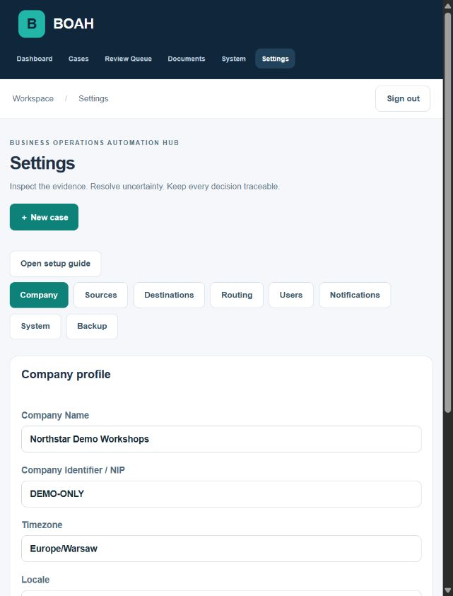
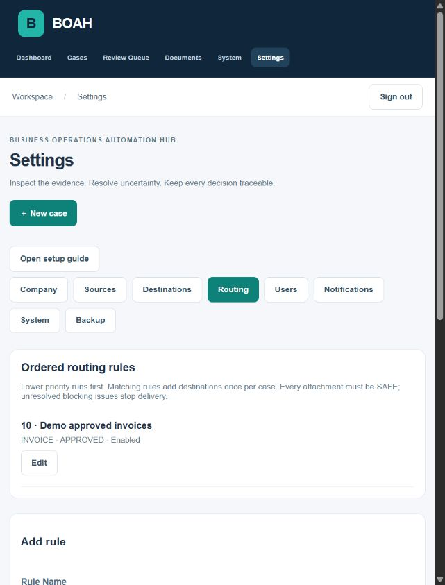
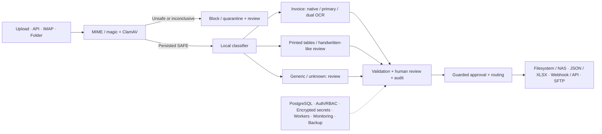

# Business Operations Automation Hub

**A self-hosted document operations platform for secure intake, classification, extraction, human review and downstream delivery.**

BOAH brings incoming documents into one traceable workflow. It separates machine readings from business validation and human decisions, then routes approved records to configured destinations.

```text
Email / Folder / API / Upload → Security → Classification → Extraction → Validation
→ Human Review → Approval → Routing → Archive / JSON / XLSX / SFTP / Webhook
```

[Run the demo](#quick-start) · [Case study](docs/portfolio/CASE-STUDY.md) · [Capabilities](docs/portfolio/CAPABILITIES.md) · [Demo guide](docs/demo/DEMO-GUIDE.md) · [Security review](docs/milestone7/security-review.md)

## Overview

The project addresses a practical operations problem: documents arrive through different channels, while staff must check their safety, interpret their contents, resolve uncertainty and transfer reliable data elsewhere. BOAH provides an operator workspace, original-document evidence, controlled approval and an audit trail.

This is an independently developed portfolio project with measured local tests and synthetic demonstrations. It has not been deployed at a customer. It is a single-company application, not a hosted multi-tenant SaaS.

## Key capabilities

- Upload/API, native IMAP and watched-folder intake with content/message deduplication.
- MIME/magic validation, ClamAV and fail-closed security before document analysis.
- Invoice routing using native PDF text, primary OCR and selective dual OCR.
- Conservative document classification, table/cell evidence and human review of unresolved values.
- Business validation, reasoned corrections, approval guards, JSON/XLSX exports and audit.
- Filesystem/NAS mounts, pinned-key SFTP and signed webhooks with durable jobs/retries.
- Company configuration, local authentication/RBAC, encrypted secrets, service health and backup/restore.

## Screenshots

The views below were captured from the running **synthetic M8 demo**. See the [gallery and provenance](docs/portfolio/screenshots/README.md) for case, intelligence, review, settings and service-health views.

| Operator overview | Document and human review |
|---|---|
|  |  |

| Company settings | Routing |
|---|---|
|  |  |

## Architecture



FastAPI owns the workflow and database transactions; n8n provides orchestration and the review-notification handoff. Storage is accessed through an abstraction backed by local filesystem volumes. OCR runs in separate CPU services. See [architecture](docs/architecture.md) and the [engineering case study](docs/portfolio/CASE-STUDY.md).

## Example workflow

An invoice arrives through IMAP. BOAH stores and hashes its original, scans it, classifies it and chooses the invoice route. Missing fields, invalid checksums or conflicts create review work. A reviewer confirms values against the original with a reason. Only valid, safe cases can be approved. Workers archive the PDF, create JSON/XLSX and send a signed webhook. Every significant operation remains auditable.

## Security

Upload preflight includes size, MIME/magic and dangerous-content checks. ClamAV must provide a conclusive result; unavailable scanning does not permit extraction. Authentication uses Argon2id and opaque HttpOnly sessions, CSRF protection and backend role enforcement. Connector secrets are write-only AES-GCM records. Outbound connections use DNS/IP checks, no redirects and SFTP host-key verification; mount paths/templates reject traversal. The production profile uses HTTPS and private service ports.

These controls are backed by negative-path tests and local E2E evidence, not an independent security certification. See the [full review and residual risks](docs/milestone7/security-review.md).

## Integrations

| Input | Output / orchestration |
|---|---|
| Manual upload, REST API | Stored originals and JSON/XLSX exports |
| Native IMAP with production TLS | Filesystem / mounted NAS archive |
| Stable watched-folder files | SFTP with pinned host key |
| n8n inbound orchestration | HMAC-signed webhook / API receiver, review outbox |

Credentials belong to the deployed instance, never workflow templates. Delivery is at least once: receivers must honor idempotency keys. A recorded n8n receipt means durable handoff, not proof that a final email was sent.

## Human review

Uncertain results remain visible with their original evidence. Raw machine values and reviewed values are separate. Corrections require a reason; table review uses revisions to reject stale edits. Approval is enforced by the backend, including attempts made directly through the API. Security quarantine cannot be waived through ordinary document review.

## Document intelligence

The classifier uses versioned local content/layout heuristics; its score is not a calibrated probability. Invoices retain the existing native-text/selective-OCR route. Printed tables expose cell geometry and confidence. Generic and unknown documents require review.

**BOAH does not include a full model for recognizing real human handwriting.** The handwritten-table workflow is human-in-the-loop: unsupported readings remain unresolved. The demo's rasterized italic text is a clearly labeled proxy, not real handwriting or evidence of HTR accuracy.

## Deployment

Two distinct profiles are provided:

- **Local demo:** isolated project, loopback HTTP, random runtime credentials and synthetic data. Never expose this profile publicly.
- **Production-oriented deployment:** standalone [production compose](docker-compose.production.yml), Caddy HTTPS, private services, persistent volumes and non-root/read-only application containers. Requires your own master key, administrator credentials, DNS/TLS and connector credentials.

The recorded HTTPS smoke test used an explicitly trusted local CA. It is not a public production deployment. Follow [production operations](docs/milestone7/deployment.md), [configuration](docs/CONFIGURATION.md) and [troubleshooting](docs/TROUBLESHOOTING.md).

## Quick Start

### A. Local demo / showcase

Requirements: Windows PowerShell, Git checkout, Docker Desktop in Linux-container mode and free loopback port **3080**. Internet is needed on first use for images, OCR models and antivirus signatures. Allow sufficient RAM/disk for both CPU OCR services; first start can take several minutes.

```powershell
# From the repository root:
.\scripts\demo\start_demo.ps1
```

Open **http://localhost:3080**. Random local login details are saved in ignored `.runtime-demo/login.txt`; do not publish that file. The script builds the existing application, applies migrations, bootstraps identities, imports the scoped local n8n workflow and seeds seven synthetic cases.

Optional local email demo:

```powershell
.\scripts\demo\start_demo.ps1 -WithEmail
```

No Gmail/Office365 account is needed. Re-running start preserves credentials/data and seeds without duplicate sample cases. To stop without deletion, use the compose command in the [demo guide](docs/demo/DEMO-GUIDE.md). To reset only the dedicated demo:

```powershell
.\scripts\demo\reset_demo.ps1
# Requires typing the fixed demo project name before permanent deletion.
```

### B. Production-oriented local deployment

Prepare protected `.env.production` from [the production example](deploy/milestone7/production.env.example), dedicated directories, a separately stored 32-byte base64 master key and a real HTTPS domain. Then:

```powershell
docker compose --env-file .env.production -f docker-compose.production.yml config --quiet
docker compose --env-file .env.production -f docker-compose.production.yml up -d --build
```

Do not combine this file with development/demo overlays. Only the reverse proxy publishes 80/443. See [deployment instructions](docs/milestone7/deployment.md) for ownership, bootstrap, backup and key recovery.

## Demo

[Seven independent synthetic fixtures](demo/README.md) cover a completed invoice, an invoice requiring checksum correction, printed and handwritten-like tables, a memo, an unknown document and harmless text blocked by filename policy. Seed confirmation is explicit demo setup, not an accuracy measurement. No benchmark/HOLDOUT data is read by the demo.

Use the [5–10 minute walkthrough](docs/demo/DEMO-GUIDE.md) or [3–5 minute recording script](docs/demo/VIDEO-SCRIPT.md). The main story is intake → SAFE → invoice → review → approval → archive/exports/webhook → audit.

## Test coverage

Tests exercise workflow states, business rules, API/DB transactions, PostgreSQL concurrency, security boundaries, review revisions, routing/retries and exports. Local protocol E2E covers SMTP/IMAP, SFTP and signed HTTP. Backup/restore checks actual storage hashes and encrypted records; production smoke checks real HTTPS and secure session cookies.

The recorded M7 baseline is **281 passed / 2 PostgreSQL-only skips on SQLite**, **283 passed on PostgreSQL**, and **9 n8n tests passed**. Current release checks and exact commands are in [the M8 report](docs/milestone8/Milestone-8-raport.md) and [release checklist](docs/portfolio/RELEASE-CHECKLIST.md). These are local verification results; no GitHub Actions badge or hosted CI result is claimed.

## Benchmark / evaluation results

| Recorded evaluation | Result | Practical boundary |
|---|---|---|
| [Invoice STP HOLDOUT](datasets/stp/results/stp-holdout-final/report.md) | 19/20 = **95% STP**, zero observed critical/document false accepts | Small synthetic dataset; not universal invoice accuracy |
| [Classification/table HOLDOUT](docs/milestone6/holdout-results.md) | **85% classification**, **75% table structure**, **30.56% cell accuracy**, **25% numeric-cell accuracy** | 20 synthetic documents; missing cells count as incorrect; handwriting proxy |
| Same M6 evaluation | **95% review rate**, zero measured unsafe bypasses | Conservative workflow, not fully automatic table processing |
| [Company integration E2E](docs/milestone7/e2e.json) | Real local IMAP/SFTP/signed webhook, retry/dead-letter and security checks passed | Synthetic credentials and local services |
| [Backup/restore](docs/milestone7/backup-restore-e2e.json) / [HTTPS](docs/milestone7/production-smoke.json) | 140 stored objects verified, 4 encrypted records decrypted; HTTPS smoke passed | Isolated local targets; public ACME not tested |

Historical HOLDOUTs were frozen and evaluated once. The demo does not reuse them and release checks do not rerun them. See [evaluation notes](docs/portfolio/EVALUATION.md) for denominators and limitations.

## Known limitations

Single-company local identities; no multi-tenancy, SSO/MFA, public SaaS, HA or PITR. Table layout and handwriting need substantial human supervision. No manual reconstruction of missing table structure is provided. Private network/mount administration is trusted. Dead-letter integration failures require action; malformed IMAP input may stall a source batch. Notification channels, n8n backup and external archive backup need deployment-specific configuration. Durable delivery snapshots do not yet have a retention lifecycle. No customer deployment or broad real-world document accuracy is claimed.

## Technology stack

| Area | Technologies actually used |
|---|---|
| Backend | Python, FastAPI, Pydantic, SQLAlchemy, Alembic, PostgreSQL |
| Frontend | Next.js, React, TypeScript |
| Documents | PyMuPDF, Tesseract, PaddleOCR, openpyxl; ReportLab for synthetic demo fixtures |
| Automation | n8n, IMAP, SFTP, signed webhooks |
| Security / operations | ClamAV, Argon2id, AES-GCM, Caddy, Docker Compose, Prometheus-compatible metrics |

## Repository structure

```text
backend/       API, domain services, security, extraction, migrations and tests
frontend/      Operator dashboard, document review and company settings
n8n/           Sanitized workflows, code and workflow tests
ocr-services/  Existing CPU Tesseract and PaddleOCR services
security/      ClamAV profile
scripts/       Demo, operations and evaluation tooling
demo/          Independent synthetic showcase fixtures
docs/          Architecture, operations, portfolio, demo and measured reports
datasets/      Preserved evaluation data and results; not used as demo seed
deploy/        Production and local-demo reverse-proxy configuration
```

## Documentation

- [Portfolio case study](docs/portfolio/CASE-STUDY.md) and [business summary](docs/portfolio/PORTFOLIO-SUMMARY.md)
- [Capability matrix](docs/portfolio/CAPABILITIES.md), [evaluation](docs/portfolio/EVALUATION.md), [screenshots](docs/portfolio/screenshots/README.md)
- [Demo guide](docs/demo/DEMO-GUIDE.md), [video script](docs/demo/VIDEO-SCRIPT.md), [fixtures](demo/README.md)
- [Configuration](docs/CONFIGURATION.md), [troubleshooting](docs/TROUBLESHOOTING.md), [production operations](docs/milestone7/deployment.md), [security review](docs/milestone7/security-review.md)
- [Architecture](docs/architecture.md), [domain model](docs/domain-model.md), [n8n](n8n/README.md), [OCR services](ocr-services/README.md)
- Historical reports: [M1](docs/verification.md), [M2](Milestone-2-raport.md), [M3](Milestone-3-raport.md), [M4](docs/milestone4/Milestone-4-raport.md), [M5](docs/milestone5/Milestone-5-raport.md), [M6](docs/milestone6/Milestone-6-raport.md), [M7](docs/milestone7/Milestone-7-raport.md)
- [Proposed demo release notes](docs/portfolio/RELEASE-NOTES.md), [checklist](docs/portfolio/RELEASE-CHECKLIST.md), [M8 report](docs/milestone8/Milestone-8-raport.md)

## Roadmap / future possibilities

Independent evaluations on unseen templates and real consented/anonymized data; better deskew/layout handling; a separately evaluated local handwriting provider; confidence calibration; SSO/MFA; dedicated metrics authentication; snapshot retention and stronger backup authentication. These are possibilities, not implemented capabilities. Existing HOLDOUTs must not be used for further tuning.

## License / project status

No LICENSE file is currently included; a licensing decision is pending. Third-party components retain their own licenses. This is an independent portfolio/demo project using fictional data; proposed `v1.0.0-demo` notes do not create a Git tag or GitHub Release.
