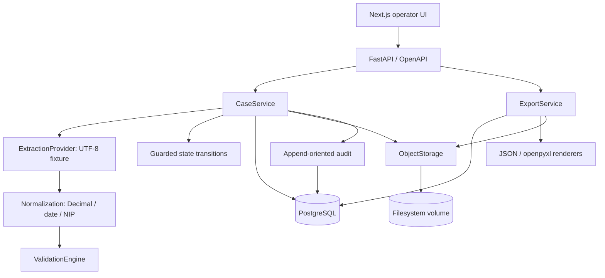
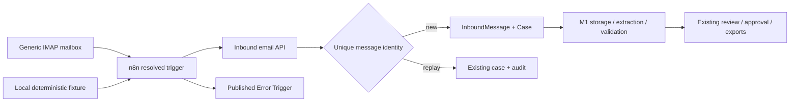

# Architecture

Milestone 1 extends the prepared modular monolith. Routes validate HTTP input and call application services; there is no duplicate domain implementation in the UI.

## Boundaries

- `CaseService` owns transactions, guarded transitions, review and audit. Mutating existing cases first SELECT FOR UPDATE on PostgreSQL, serializing approval, corrections, uploads and exports for the same case. Case creation flushes the parent before inserting child audit events. Routes commit successful operations; dependency-scoped sessions roll back uncommitted work on failure.
- `ExtractionProvider.extract(bytes)` consumes bytes retrieved through ObjectStorage. The interface was changed from a filesystem Path to bytes so future remote object stores do not leak local physical paths into extraction. DevelopmentExtractionProvider parses known UTF-8 key/value labels and returns raw fields only.
- Normalization is independent and uses Decimal/date parsing. ExtractedField stores immutable raw values and the normalization result, attachment ID and provider. Current reviewed values live on Case; invalid/conflicting normalization is retained in Case.normalization_errors. Corrections only change the business record and emit before/after/input audit details and ReviewDecision records.
- ValidationEngine produces deterministic severity/code/message issues. Services persist them, resolve obsolete issues with an audit event and retain the history. Unchanged issues are not resolved/recreated on every run. Only ERROR/CRITICAL block approval. Approval always revalidates, including the current date.
- `domain/state_machine.py` defines all legal transitions. FAILED is terminal for both rejection and provider/storage processing failure; the decision/audit event distinguishes them. DUPLICATE is available in the model but not used to invalidate a case that already contains the original. Exact duplicate uploads are skipped with a warning and audit event.
- ObjectStorage exposes put/get, with opaque keys. LocalFilesystemStorage alone resolves physical paths, creates the base directory, rejects traversal/absolute/drive paths and uses exclusive UUID-key creation. Filenames remain metadata. There is no direct document filesystem access in the application services.
- JSON uses an explicit versioned business payload. openpyxl renders business-oriented sheets and treats all untrusted strings as text, never formulas. Export artifacts are stored behind the same storage interface. Generation and download are separate endpoints; repeated downloads do not produce new export events. Repeated generation from EXPORTED is permitted.

## Persistence and concurrency

PostgreSQL stores seven existing entity types: Case, Attachment, ExtractedField, ValidationIssue, ReviewDecision, Export and AuditEvent. Source is the constrained API enum on Case, not a separate unnecessary lookup table. The public case ID and attachment storage key are unique. `(case_id, sha256)` is unique, complementing the serialized duplicate check. Test runs use isolated PostgreSQL schemas; default SQLite tests also enable foreign keys.

Each valid business operation and its audit records commit together. Blocked approval commits the revalidation findings before returning 409. Provider/storage failures while processing are committed as FAILED with a processing_failure audit event. Export storage failures roll back the tentative success event/state change, then persist a failed Export and processing_failure event. Invalid transport input does not create an attachment or mutate the case. Files already written may remain orphaned after a database failure; cleanup is deliberately deferred and documented.

## Why filesystem storage

The local persistent Docker volume provides the required original/artifact persistence with no additional service or credentials. MinIO is not deployed. A future S3-compatible implementation can implement ObjectStorage.put/get and be selected at dependency wiring; business logic and extraction signatures remain unchanged. Streaming and background jobs are future extensions; current uploads are bounded to ten files of up to 5 MiB each.

## Diagram

No authentication, background queue, OCR, AI provider or multi-tenancy is implemented. Email ingestion is added by Milestone 2 below. Actor strings are explicit placeholders and not trusted identity assertions. The local deployment should not be exposed publicly.

## Milestone 2 extension

InboundMessage is a new eighth table, linked one-to-one to Case. It stores source metadata, text/HTML, stable identity and ingestion outcome. The core change is an opt-in email review mode for uploads and retention of unresolved email attachment issues. Manual upload behavior and tests are unchanged. SourceType includes email internally; generic case-create still disallows email without its source message.

EmailIngestionService reserves `(source_type, identity_key)` using INSERT ON CONFLICT DO NOTHING before creating the case. PostgreSQL uniqueness serializes simultaneous deliveries; case, message, attachment records and audit commit together. A rollback removes the identity reservation. Replay returns current case state and records EMAIL_DUPLICATE_IGNORED without repeating extraction. Fallback fingerprints exclude variable receipt time and filenames. See n8n/README.md for canonical inputs and ambiguities.

A single bounded JSON request includes base64 attachments. n8n resolves binary bytes using its storage helpers, forwards allowlisted metadata and classifies backend responses. Bounded retries plus saved-execution replay implement at-least-once delivery attempts. n8n SQLite is orchestration state, not the BOAH business database. Its persistent volume holds encrypted credentials, the auto-generated key and execution binaries; none is committed.

HTML is rendered as escaped text only. Unsupported attachments are retained with persistent ERROR issues until explicit operator review with a reason. The M1 validation engine continues to enforce all business rules; acknowledging a document cannot waive other blockers. A committed FAILED case stays terminal as in M1; automatic reopening is outside scope.

