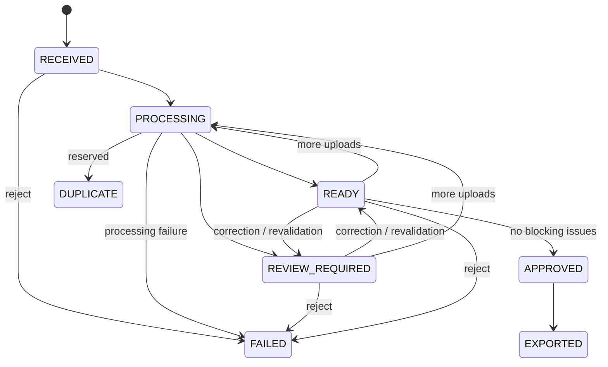

# Domain model

Case contains the reviewed business fields, source (`manual_upload`, `api` or internally linked `email`), status, timestamps and active normalization errors. Identifiers are generated server-side as UUIDs; the stable public ID is `CASE-year-20 UUID hex characters` with a unique database constraint.

Attachment records the original filename, MIME type, size, SHA-256 and opaque storage key. Hash uniqueness is scoped to a case; unrelated cases can reuse a source document.

ExtractedField retains raw text, its independently normalized result, source attachment, provider and optional confidence. Manual changes do not rewrite these records.

ValidationIssue records code, severity, field, message and resolved state. Resolving an issue appends a timestamped audit event referencing its ID. Revalidation keeps the history and does not duplicate unchanged active issues.

ReviewDecision records approve/reject/correct, an actor placeholder, comment and correction changes. AuditEvent records each meaningful operation and status change chronologically. Export records type, artifact key, success/failure metadata and time. Source is represented directly on Case.

Repeated validation with an unchanged status does not emit a fictitious status transition. Approved/exported/failed cases cannot be edited, rejected or uploaded to. Repeated export generation in EXPORTED is allowed without a status transition. Duplicate attachment warnings leave the original case usable; the reserved DUPLICATE terminal state is not assigned by the within-case deduplication policy.

## InboundMessage (Milestone 2)

A dedicated source entity containing source_type=imap, original Message-ID, identity_key/method, sender/name, To/Cc/Reply-To, original subject, timezone-aware receipt/sent times, text/HTML, processing status, attachment outcomes and timestamps. `(source_type, identity_key)` and case_id are unique. case_id is nullable only during an uncommitted reservation; accepted delivery commits the case link atomically. Reviewed business corrections leave this source record unchanged. processing_status describes ingestion, while Case.status is the current business state.

A replay adds EMAIL_DUPLICATE_IGNORED without reprocessing. EMAIL_ATTACHMENT_UNSUPPORTED and EMAIL_EXTRACTION_FAILED issues persist across revalidation until operator acknowledgment with a reason; that acknowledgment cannot resolve unrelated validation issues. No new business state is introduced.
