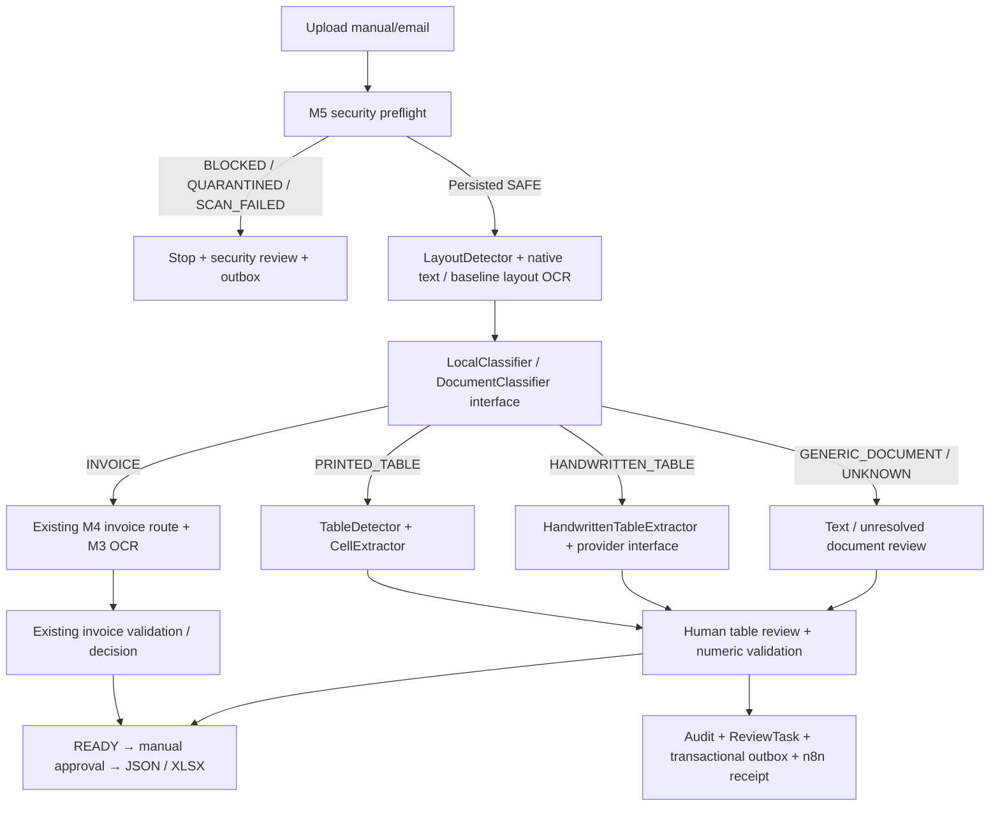
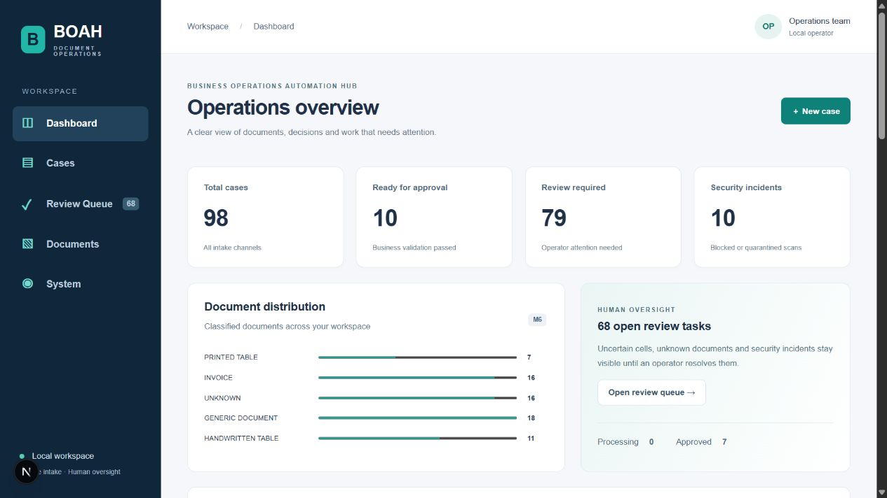
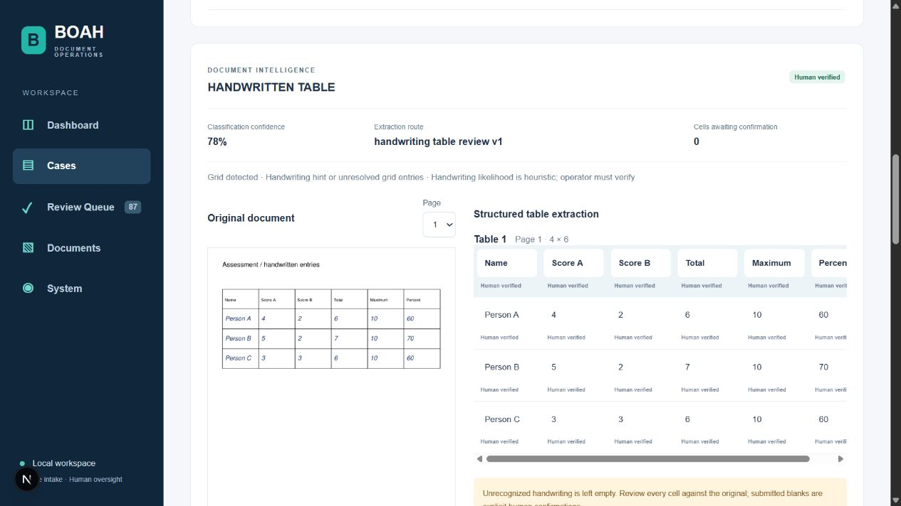
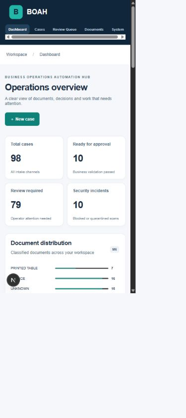

# Milestone 6 — raport końcowy

Data: 2026-09-29. Repozytorium: `C:\AI\BusinessOperationsAutomationHub`.
Branch: `milestone-6-document-classification-adaptive-extraction-ui`, baza `ae7eca1`.
Zmiany pozostawiono w working tree. **Nie wykonano commit ani push.**

## Wynik i zakres

M6 dodaje klasyfikację po zapisanym SAFE, routing dokumentów, relacyjne tabele i komórki, konserwatywną obsługę pisma ręcznego, walidację, audytowalne korekty, eksport tabel JSON/XLSX oraz panel administracyjny. Zamknięto E2E A–F i wszystkie wymagane quality gates. M3/M4 invoice core oraz M5 preflight zachowano. M4 HOLDOUT nie był uruchamiany ani modyfikowany.

To działający workflow dokumentów wymagających nadzoru, **nie automatyczny system rozpoznawania dowolnego pisma ręcznego**. Nie ma dołączonego modelu handwriting; brak odczytu pozostaje `null`, a operator potwierdza wartości na podstawie oryginału. Wyniki jakości opisano bez ukrywania braków.

## Architektura



`app/adaptive/contracts.py` rozdziela Evidence, Classification, Table, Cell oraz interfejsy DocumentClassifier/HandwritingProvider. `layout.py`, `classifier.py`, `handwriting.py`, `validation.py` i `service.py` mają odrębne odpowiedzialności. Klasyfikacja wymaga najnowszego zapisanego skanu SAFE; nie ma ręcznego override quarantine.

Klasyfikator `local-signals-v1` jest deterministyczną heurystyką, nie wytrenowanym modelem ani skalibrowanym prawdopodobieństwem. Wynik zapisuje typ, score confidence, wersję, powody, czas, stronę/geometrię i strategię. Dane w tabelach nie trafiają do pól faktury.

| Typ | Sygnały i strategia |
|---|---|
| INVOICE | Co najmniej 3 grupy słów fakturowych; istniejąca ścieżka M4 |
| HANDWRITTEN_TABLE | Siatka oraz wskazówka handwriting lub ponad 35% niepewnych wpisów; zawsze review |
| PRINTED_TABLE | Siatka z czytelnymi komórkami; w M6 również wymagana weryfikacja człowieka |
| GENERIC_DOCUMENT | Co najmniej 60 znaków bez pewnych sygnałów faktury/tabeli; review |
| UNKNOWN | Konflikt, zbyt mało danych lub błąd analizy; nigdy automatyczna akceptacja |

Audyt obejmuje DOCUMENT_CLASSIFICATION_STARTED, DOCUMENT_CLASSIFIED, DOCUMENT_CLASSIFICATION_UNCERTAIN, ADAPTIVE_EXTRACTION_STARTED/COMPLETED/REVIEW_REQUIRED oraz DOCUMENT_REVIEW_CORRECTED. Stare zdarzenia i walidacja faktur pozostają aktywne.

## Layout, OCR i handwriting

- PyMuPDF 1.28.2: tekst natywny, `find_tables`, geometria komórek i bezpieczny raster podglądu. Wiersz 0 pełni rolę nagłówka. Puste/nieregularne regiony pozostają niepewne; merged cells mają jawny znacznik irregular, bez automatycznego odtwarzania semantyki.
- Raster: ograniczona detekcja poziomych/pionowych linii przez projekcję pikseli. Próg luminancji 200 wybrano wyłącznie na DEV; 110 pomijał antyaliasowane cienkie linie. Brak deskew i zaawansowanego modelu struktury tabel.
- CellExtractor przypisuje istniejące słowa Tesseract według geometrii, zachowuje minimalne confidence i flaguje wynik poniżej 0.9. Layout używa profilu baseline. **Istniejące profile orientation obu OCR w M4 pozostają niezmienione.**
- HandwrittenTableExtractor nie promuje odczytu drukowanego OCR do wiarygodnego handwriting. Natywne drukowane komórki są zachowane, nierozpoznane wpisy pozostają puste. Domyślny `UnavailableHandwritingProvider` zwraca null/0 i jednoznaczne źródło. Interfejs pozwala wstrzyknąć przyszłego lokalnego providera; M6 nie instaluje ani nie pobiera modelu handwriting, nie dodaje GPU ani nowego zewnętrznego endpointu. Obecny routing używa fallbacku i nie przygotowuje cropów dla nieistniejącego modelu.
- Limity: 10 stron, maksymalnie 4 mln punktów powierzchni strony, 1000 komórek dokumentu; przekroczenie trafia do UNKNOWN/review. M5 zachowuje limit uploadu i skanowanie fail-closed.

Wersje/config istniejących usług OCR identyfikuje snapshot obrazów Docker oraz hashe ich kodu i requirements w freeze. Nie zaktualizowano modeli OCR. ClamAV podczas E2E: 1.4.6, sygnatury 28137. Heurystyki klasyfikacji/layout są deterministyczne; Tesseract/Paddle to istniejące silniki OCR/ML; decyzje manualne są osobnymi, audytowanymi korektami.

## Walidacja, review i eksport

Walidacja używa Decimal i wyłącznie jawnych semantyk nagłówków: score/points/punkty, total/sum/suma/razem, maximum/max/possible, percent/percentage/procent. Sprawdza parsowanie, liczby ujemne, sumy składników, zakres 0–100%, zgodność total/maximum (tolerancja 0.51 punktu procentowego) oraz wiersze sum kolumn. Nie dopowiada wzorów ani brakujących liczb. Nierozpoznane etykiety/formuły pozostają odpowiedzialnością operatora.

Korekta wymaga powodu, revision i przynależności komórek do dokumentu. Blokada sprawy i optimistic revision chronią przed nadpisaniem. Surowy odczyt jest niezmienny, poprawka ma osobne pole. Każda niepewna komórka wymaga jawnego potwierdzenia (także pustej, o ile walidacja liczb na to pozwala). Nie można obejść DOCUMENT_REVIEW przez ogólne resolve zadania. Po APPROVED/EXPORTED edycja jest blokowana przez istniejącą maszynę stanów.

JSON otrzymuje addytywne `documents` dla spraw M6; stary payload bez dokumentów nie zmienia się. XLSX dodaje arkusz na tabelę i zachowuje Summary/Attachments/Validation/Audit. Używa corrected_value, jeśli istnieje; tekst komórek pozostaje typem string, nie wykonywalną formułą.

## Baza i API

Migracja `59bc8877f30b → ad14d3ede9c3`: document_analyses, document_tables, document_cells, document_corrections; FK, unikalność komórki/table oraz attachment/classification, ograniczenia typu i confidence. JSON przechowuje elastyczne artifacts, bbox, reasons i diff korekt, a nie całą tabelę zamiast relacji. ReviewTask dopuszcza DOCUMENT_REVIEW. Upgrade na istniejącej bazie M5 i `alembic check` zakończyły się powodzeniem.

Nowe endpointy pod `/api/v1`:

- `GET /documents/summary` — rzeczywiste agregaty spraw, typów, skanów i zadań.
- `GET /documents/{id}` — klasyfikacja, tabele, komórki, walidacja.
- `GET /documents/{id}/preview?page=1` — oryginał SAFE jako PNG; tekst jako text/plain.
- `POST /documents/{id}/review` — `{revision, reason, cells:[{cell_id,value}]}`.
- `GET /cases?q=...&status=...&offset=...&limit=...` — filtrowanie i addytywne document_types/security_states.

Dotychczasowe upload, review/approve/reject, email, OCR review, exports i notification endpoints zachowano.

## Frontend

Obecny Next.js/React bez nowego frameworka UI. Sidebar: Dashboard, Cases, Review Queue, Documents, System. Rzeczywiste metryki, statusy, typy i security; filtry i paginacja; loading/empty/error states; responsive layout. System opisuje konfigurację, nie udaje live health. Dotychczasowy widok dostępny jest także jako Compatibility workspace.

CaseWorkspace zachowuje formularze i akcje M1–M5, dodaje sekcję SAFE/security oraz DocumentPanel: klasyfikacja, strategia, podgląd oryginału, edytowalna siatka, confidence, żółte komórki niepewne, walidacja i powód korekty. Audit ma rozwijane szczegóły zamiast JSON jako głównego interfejsu. Review Queue umożliwia pozostanie w zadaniu albo jawne otwarcie sprawy.

Sprawdzono desktop, viewport 390×844 (scrollWidth 375, bez overflow całej strony), preview i prawdziwy zapis 18 komórek DEV przez UI: Human verified, 0 komórek do potwierdzenia, READY, aktywne Approve. Konsola: 0 zarejestrowanych błędów. Tabele mają własny poziomy scroll na wąskich ekranach.





## Dataset i metodologia

Nowy `datasets/milestone6`: 20 DEV + 20 HOLDOUT, po 4 dokumenty na klasę. Seedy 61 i 7061; brak identycznych PDF pomiędzy splitami (SHA-256). Nazwy Person A–D, liczby i treść są syntetyczne, bez prywatnych dokumentów. Warianty: natywny PDF, odmienna liczba wierszy, raster, szum i obrót 1.2°. Split ma tę samą rodzinę szablonów; to mały test techniczny, **nie dowód generalizacji na nowe szablony lub ludzi**.

„Handwriting” jest rasteryzowaną kursywą Helvetica, nie prawdziwym pismem człowieka. Tytuły zawierają czasem jawny sygnał handwriting. Wyniku nie należy interpretować jako jakości HTR na rzeczywistych ręcznych formularzach.

DEV cleanup: generator scala strumienie PDF, ponieważ wcześniejsze liczne obiekty rysunkowe powodowały legalną blokadę limitu MaxFiles ClamAV. Nie zmieniono limitów skanera. Dodatkowo poprawiono próg detekcji siatki na DEV. Przerwane/pośrednie DEV nie były HOLDOUT. Syntetyczne sprawy tych prób zachowano w lokalnym runtime dla audytu; ich duplikaty nie trafiają do mianowników finalnych wyników i nie są plikami do Git.

Ocena idzie przez prawdziwy BOAH API → ClamAV → PostgreSQL → pipeline. Ground truth jest używany tylko przez evaluator do porównania, nie do ekstrakcji. Metryki są mierzone przed ręcznymi korektami. 8 tabel / 216 komórek (w tym nagłówki), 140 komórek liczbowych na split. Brak tabeli/komórki liczy się jako błąd i unresolved, nie znika z mianownika. Structure accuracy wymaga zgodnej liczby tabel oraz wierszy/kolumn.

## Freeze i HOLDOUT

Freeze: `configs/milestone6/freeze.json`, 166 plików (backend, kod OCR, dependencies, migracja, generator/evaluator/E2E, nowe dane) oraz runtime settings i image IDs. SHA-256:

`6a7d664018681c92b79d655e23c1ffbcd5d3c925094e8fa2c81b613dc5c3389b`

Freeze utworzono przed finalnym HOLDOUT. Evaluator weryfikuje hashe i runtime, następnie tworzy wyłącznie nowy `holdout-started.json`; istniejący marker blokuje drugi przebieg. **Wykonano jeden przebieg HOLDOUT. Nie strojono pipeline po wyniku.** Ponowna kontrola po wykonaniu potwierdziła zgodność wszystkich 166 hashy i runtime. Raporty JSON/CSV/Markdown są obok tego raportu. Stary M4 HOLDOUT pozostał nietknięty.

| Metryka | DEV | HOLDOUT |
|---|---:|---:|
| Klasyfikacja ogółem | 17/20 = 85% | 17/20 = 85% |
| INVOICE | 4/4 = 100% | 4/4 = 100% |
| HANDWRITTEN_TABLE | 3/4 = 75% | 3/4 = 75% |
| PRINTED_TABLE | 2/4 = 50% | 2/4 = 50% |
| GENERIC_DOCUMENT | 4/4 = 100% | 4/4 = 100% |
| UNKNOWN | 4/4 = 100% | 4/4 = 100% |
| UNKNOWN rate | 5/20 = 25% | 4/20 = 20% |
| Review rate | 19/20 = 95% | 19/20 = 95% |
| Struktura tabel | 6/8 = 75% | 6/8 = 75% |
| Cell accuracy | 66/216 = 30.56% | 66/216 = 30.56% |
| Numeric cell accuracy | 35/140 = 25% | 35/140 = 25% |
| Unresolved / low confidence | 150/216 = 69.44% | 150/216 = 69.44% |
| Unsafe high-confidence misclassification | 0 | 0 |
| Fabricated critical values (operacyjna definicja poniżej) | 0 | 0 |
| UNKNOWN autoaccept | 0 | 0 |
| Low-confidence extraction bypassing review | 0 | 0 |
| Security gate bypass | 0 | 0 |

Unsafe high-confidence w evaluatorze oznacza błędną klasę z confidence ≥0.9 i automatycznym przejściem (READY/APPROVED/EXPORTED). W tych danych nie było też błędnych klas z confidence ≥0.9 niezależnie od review. „Fabricated critical” liczy błędne niepuste wyniki liczbowych komórek, oznaczone jako pewne — to test niepopartego odczytu, nie uniwersalny dowód braku halucynacji. Zero security bypass obejmuje kolejność audytu SAFE przed klasyfikacją; test sentinel i złośliwy plik E2E uzupełniają ten pomiar.

HOLDOUT ujawnił znane ograniczenia: obrócona tabela ręczna i drukowana zostały uznane za generic, a raster tabeli drukowanej za handwritten z powodu brakujących odczytów. Wszystkie pozostały w review. Nie poprawiano ich po ewaluacji. Jedyna sprawa READY bez review w każdym splicie to faktura obsłużona istniejącą ścieżką M4; nie oznacza to ręcznego APPROVED.

## Weryfikacja

| Gate | Wynik |
|---|---|
| Pełna regresja SQLite M1–M6 | **226 passed, 2 skipped** |
| Pełna regresja PostgreSQL M1–M6 | **228 passed** |
| Dedykowane testy M6 (zawarte powyżej) | **18 passed** |
| Ruff app/tests/alembic i scripts/milestone6 | PASS |
| mypy | PASS, 73 source files |
| Frontend lint / typecheck / build | PASS / PASS / PASS |
| n8n node:test | **9 passed** |
| Alembic upgrade / check | PASS / No new upgrade operations detected |
| Live E2E | **6/6 scenariuszy PASS** |
| Korekta → READY → APPROVED → JSON/XLSX | PASS, rzeczywiste API i DB |
| Powiadomienia M5 | PASS, trwałe REVIEW_NOTIFICATION_SENT / local n8n receipt |
| UI | desktop/mobile/preview/review PASS, konsola bez błędów |
| Docker | PostgreSQL/backend/ClamAV/Tesseract/Paddle/n8n healthy, worker running |
| HTTP | UI 3000, backend 8000, OCR 8011/8012, n8n 5678: 200 |
| Git diff --check | PASS |
| Freeze po HOLDOUT | 166/166 hashy i runtime zgodne |

Dwa pominięcia SQLite dotyczą testów zależnych od PostgreSQL; w regresji PostgreSQL nie ma pominięć. Dedykowane testy obejmują pięć klas, konflikt/UNKNOWN, zachowanie M4, strukturę, propagację confidence, walidację sum/procentów, task, korekty, stale revision, audyt, blokadę po approval, sentinel nie-SAFE, preview, search oraz JSON/XLSX. Legacy fixtures świadomie wyłączają nową warstwę, by zachować stare syntetyczne fake-PDF; testy M6 włączają jednocześnie security/adaptive/OCR/STP.

E2E: A INVOICE SAFE → NATIVE_TEXT M4; B PRINTED_TABLE SAFE → tabela; C HANDWRITTEN_TABLE SAFE → niepewne komórki → jawna korekta → approval/export; D GENERIC_DOCUMENT; E UNKNOWN/review/approval 409; F standardowy nieszkodliwy ciąg EICAR → BLOCKED, brak DocumentAnalysis/OCR i brak wywołania klasyfikacji. Nie zapisano EICAR jako fixture w repo. Powiadomienia trafiają do istniejącego lokalnego sinka, nie do osób.

## Ograniczenia i następny etap

Brak modelu HTR i niska kompletność OCR komórek wymagają pracy człowieka. Detekcja oparta na prostych siatkach jest słaba dla obrotu, tabel bez linii, nieregularnych nagłówków i rzeczywistych formularzy. Klasyfikator heurystyczny może pomylić tabelę drukowaną z ręczną. W M6 wszystkie dokumenty niefakturowe wymagają review, nawet poprawnie rozpoznane printed/generic. Edycja struktury tabel i manualne przeklasyfikowanie nie są dostępne; operator może skontrolować treść, poprawić istniejące komórki lub odrzucić sprawę. Brakujące struktury pozostają manualnym review, nie są automatycznie odtwarzane.

W przyszłym, osobno ocenianym etapie: rzeczywiste zanonimizowane handwriting z nowym podziałem danych, lokalny model HTR i crop pipeline, deskew/layout model, kalibracja confidence, testy szablonów niewidzianych w DEV. Nie wolno używać obecnego HOLDOUT do kolejnego strojenia i przedstawiać go ponownie jako niezależnego.

Aplikacja pozostaje lokalnym demonstratorem bez nowego uwierzytelniania/RBAC. Dashboard nie zastępuje monitoringu produkcyjnego. Zachowany compatibility view i kopia CaseWorkspace zwiększają koszt utrzymania UI; późniejsza wspólna ekstrakcja komponentów wymaga osobnej regresji.

## Uruchomienie i odtworzenie weryfikacji

W repozytorium, PowerShell:

```powershell
docker compose -f docker-compose.yml -f docker-compose.ocr.yml -f docker-compose.security.yml up -d --build
docker compose exec -T backend alembic upgrade head
docker compose exec -T backend alembic check
# UI http://localhost:3000 ; API http://localhost:8000/docs
backend/.venv/Scripts/python.exe scripts/milestone6/e2e.py
backend/.venv/Scripts/python.exe scripts/milestone6/evaluate.py dev
node --test n8n/tests/*.test.cjs
```

`ADAPTIVE_EXTRACTION_ENABLED=true` jest domyślne i udokumentowane w .env.example. Wymagane są działające M5 preflight/ClamAV; compose.security włącza STP i security. Istniejący n8n workflow `boahReviewM5` musi być opublikowany zgodnie z instrukcją M5 (zachowano jego konfigurację).

```powershell
Set-Location backend
.venv/Scripts/python.exe -m pytest -q
.venv/Scripts/python.exe -m ruff check app tests alembic
.venv/Scripts/python.exe -m mypy app
# TEST_DATABASE_URL=postgresql+asyncpg://...@localhost:5432/boah
# Następnie pytest; każdy test otrzymuje izolowany schemat, usuwany po teście.
Set-Location ../frontend
npm run lint
npm run typecheck
npm run build
# Po build podczas działającego dev server: docker compose restart frontend.
```

Procedura użyta JEDNORAZOWO dla nowego HOLDOUT, już zakończona:

```powershell
backend/.venv/Scripts/python.exe scripts/milestone6/fixtures.py --split holdout
backend/.venv/Scripts/python.exe scripts/milestone6/evaluate.py freeze
backend/.venv/Scripts/python.exe scripts/milestone6/evaluate.py holdout
```

**Nie usuwać markerów i nie powtarzać finalnego HOLDOUT.** Freeze/evaluator celowo odmawiają nadpisania. Do odczytu wyników używać zapisanych raportów. Restart usług nie wymaga powtarzania HOLDOUT.

## Pliki i bezpieczeństwo repozytorium

Dodano moduł adaptive, modele dokumentów, API documents, migrację, 18 testów, generator/evaluator/E2E, syntetyczny dataset i raporty. Rozszerzono routing Cases, ReviewTask, exports i frontend; nie przebudowano core M4. Pełny status znajduje się w `git-status-short.txt` obok raportu.

Nie dodano .env, sekretów, prywatnych dokumentów, storage, baz runtime, cache ani lokalnych danych n8n. Runtime sprawy benchmarkowe pozostają w istniejącym lokalnym DB/storage, poza Git. Zrzuty ekranu pokazują syntetyczne sprawy. Indeks Git pozostał pusty, HEAD pozostaje `ae7eca1`. Nie wykonano push.

W trakcie wcześniejszej części prac automatyczna kontrola odrzuciła opcjonalny adapter HTTP handwriting z powodu niezatwierdzonego przesyłania treści oraz usunięcie starych plików UI jako destrukcyjne. Zastosowano bezpieczne alternatywy: lokalny interfejs providera z jawnym fallbackiem i addytywny dashboard z zachowanym widokiem zgodności. Żadnej z odrzuconych operacji nie wykonano.
