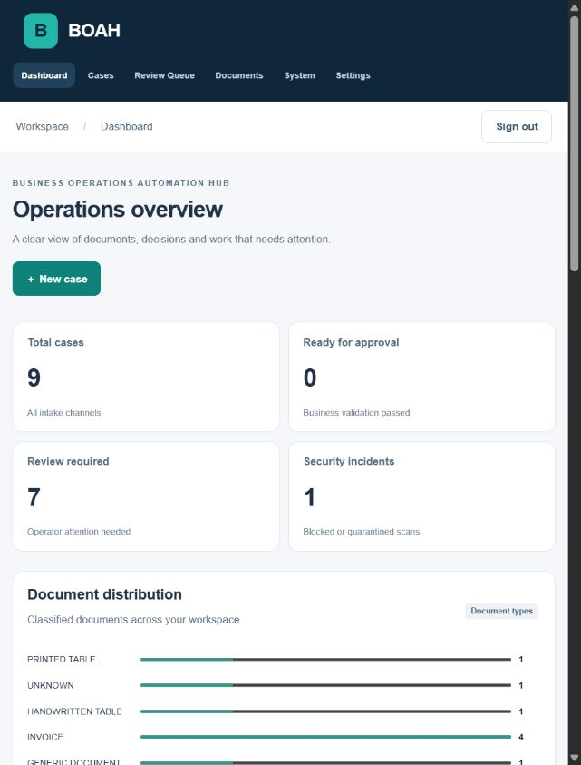
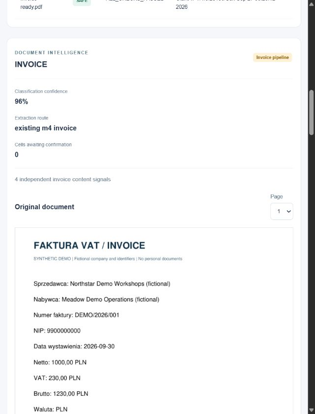
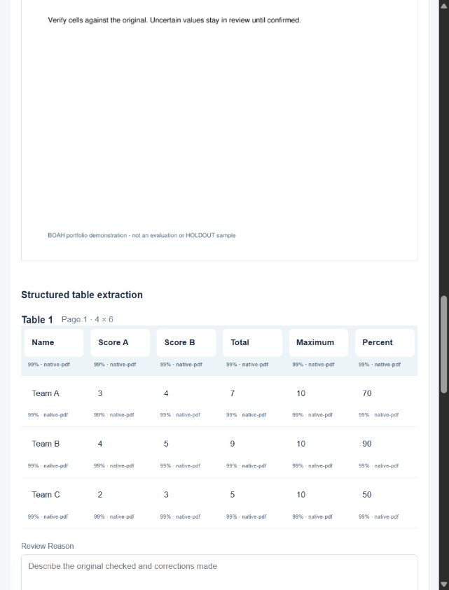
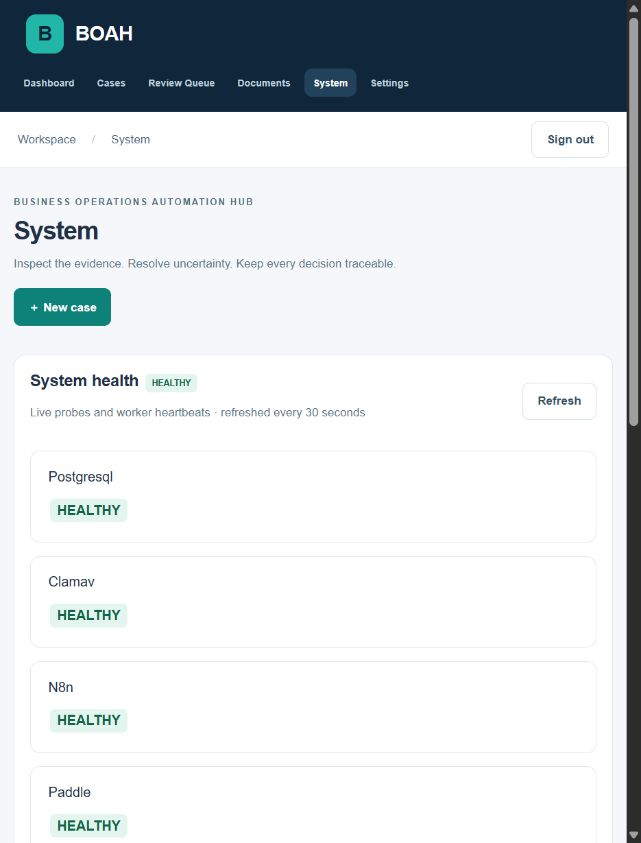

# Screenshot gallery and provenance

All thirteen JPEGs here are actual viewport captures of the running M8 synthetic demo at `http://localhost:3080`, taken on 2026-09-30 with the Codex in-app browser. They are not mockups, benchmark illustrations or reused historical images. The existing M6/M7 screenshots remain in their original directories unchanged.

The default browser viewport was used; pages were scrolled to the relevant section without altering rendered content. Full-page capture failed, but documented viewport capture worked. Long pages therefore have separate section captures. All documents, company names, identifiers and `example.com` accounts shown are synthetic. No passwords or master keys are visible.

| View | Capture | Evidence |
|---|---|---|
| Login | [login.jpg](login.jpg) | Local authenticated entry; empty password field. |
| Dashboard | [dashboard.jpg](dashboard.jpg) | Nine synthetic cases, distribution, review and security counts before UI correction. |
| Case workspace | [case-workspace.jpg](case-workspace.jpg) | Completed synthetic invoice with export controls and business fields. |
| Document intelligence | [document-intelligence.jpg](document-intelligence.jpg) | INVOICE classification, route, confidence and real original PDF preview. |
| Human review | [human-review.jpg](human-review.jpg) | Printed 4×6 table, confidence/source per cell and reasoned review form. |
| Company | [company-settings.jpg](company-settings.jpg) | Fictional company, locale and currency. |
| Sources | [sources.jpg](sources.jpg) | Private IMAP/watched-folder fixtures; credential presence without secret value. |
| Connection test | [connection-test.jpg](connection-test.jpg) | Successful durable test job after observed queued/RUNNING state. |
| Destinations | [destinations.jpg](destinations.jpg) | Archive and signed webhook. |
| Routing | [routing.jpg](routing.jpg) | Ordered approved-invoice routing with safety guards. |
| Users | [users.jpg](users.jpg) | Synthetic admin/operator/reviewer/viewer identities and role controls. |
| System | [system-health.jpg](system-health.jpg) | Healthy dependencies, workers, mounted storage and connectors. |
| Exports / audit | [exports-audit.jpg](exports-audit.jpg) | JSON/XLSX after a real UI correction → approval → export sequence. |

This is functional UI evidence, not an accuracy evaluation. The UI test subsequently completed the initially seeded “Invoice needs review” case; use the guarded reset/start workflow for a fresh live presentation. [Demo guide](../../demo/DEMO-GUIDE.md), [M8 report](../../milestone8/Milestone-8-raport.md).
